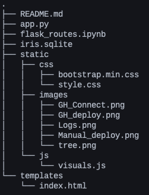
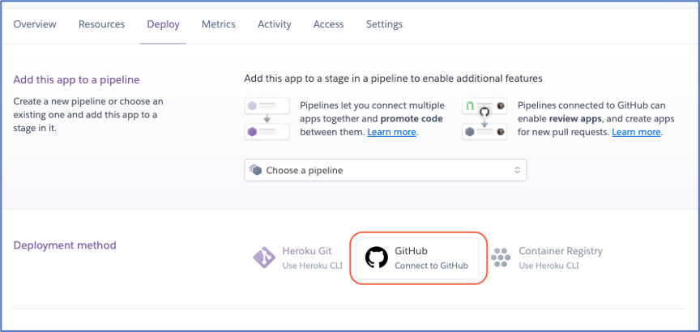
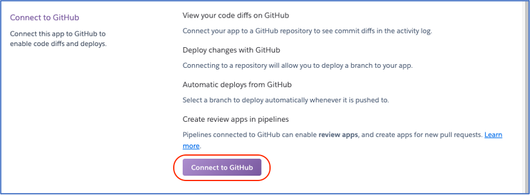
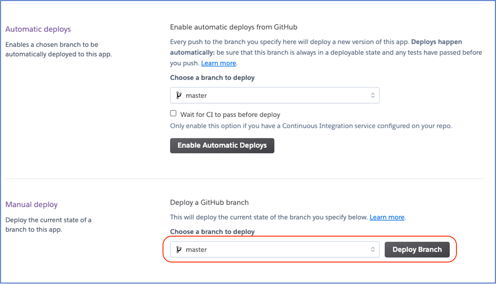
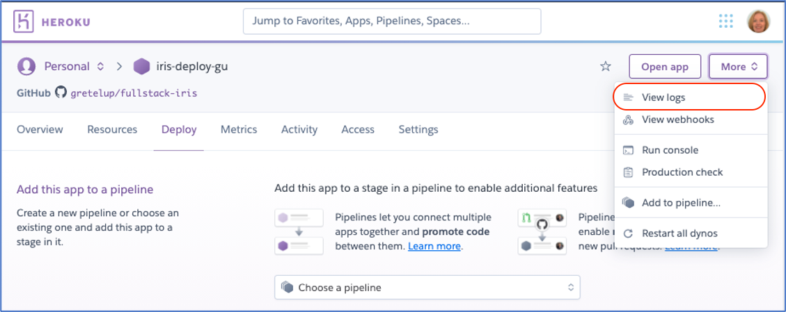

# Iris Heroku App
This is a simple full-stack flask app created using the a sqlite database of the [Iris dataset](http://archive.ics.uci.edu/ml/datasets/Iris) to help python developers deploy a flask app with basic javascript visualizations to Heroku.

A link to the deployed app can be found here: [https://iris-deploy-gu.herokuapp.com/](https://iris-deploy-gu.herokuapp.com/)

## Table of Contents

* [App Development](#app-development)
* [Heroku Deployment](#heroku-deployment)
  * [Prepping Your Repository](#part-1-prepping-your-repository)
  * [Creating Your Heroku App](#part-2-creating-your-heroku-app)

## App Development

#### Step 1: Database Creation

For simple *free* Heroku full-stack Flask applications, the best databases to use are sqlite and PostgreSQL databases. These instructions do not cover the database creation process. It proceeds assuming one of these two types of databases have been created.

#### Step 2: Plan your javascript visualizations and create html

These instructions do not cover html development. To display my visual, I created a simple html page with a `<div>` for the histogram and a dropdown menu for the species.

Before you develop your Flask routes, you must determine the data necessary to create your visualizations and the format that data must be in when you jsonify it. You must also plan for what type of interactivity you want for these visualizations.

In this example application, I used plotly to create a simple histogram of the sepal-lengths for each type of iris species in my database. The interactivity is a dropdown menu that changes the histogram to display the a single selected species or all of the species.


1. Refer to documentation to determine what data is necessary:  [Plotly's Overlaid Histogram Code](https://plotly.com/javascript/histograms/#overlaid-histgram):

	``` 
	var x1 = [];
	var x2 = [];
	for (var i = 1; i < 500; i++)
	{
		k = Math.random();
		x1.push(Math.random() + 1);
		x2.push(Math.random() + 1.1);
	}
	
	var trace1 = {
	  x: x1,
	  type: "histogram",
	  opacity: 0.5,
	  marker: {
	     color: 'green',
	  },
	};
	var trace2 = {
	  x: x2,
	  type: "histogram",
	  opacity: 0.6,
	  marker: {
	     color: 'red',
	  },
	};
	
	var data = [trace1, trace2];
	var layout = {barmode: "overlay"};
	Plotly.newPlot('myDiv', data, layout); 
	```

2. Determine best format for the jsonified data:
    * The histogram requires an array of sepal-lengths for each species.
    * For the histogram that plots all of the species, the best format of the data would be:
	  
	  ```
	  {
		    species1: [sepal-lengths],
		    species2: [sepal-lengths],
		    species3: [sepal-lengths]
	   }
	   ```
	   
     * For the histogram plotting a single species, the best format would be a simple array for just that species.

   
#### Step 3: Plan your Flask routes
In a jupyter notebook, develop Flask REST API routes for the visualizations (refer to [flask_routes.ipynb](flask_routes.ipynb)).

1. Connect to the database and query for *just* the information needed for your route. I have used SQLAlchemy ORM, but you may use any python library to query the database.

	```
	session = Session(engine)
	results = session.query(Iris.Species, Iris.SepalLengthCm).all()
	```
2. Parse the results and put into the correct format.

	```
	results_dict = {"Iris-virginica": [], 
	                "Iris-versicolor": [], 
	                "Iris-setosa": []}
	
	for species, length in results:
	    results_dict[species].append(float(length))
	```

#### Step 4: Create your Flask app

Referring to [Flask Documentation](https://flask.palletsprojects.com/en/1.1.x/quickstart/#) as necessary,  create your basic flask app with routes for your visualizations, using the code from your jupyter notebook (refer to [app.py](app.py)).


```
@app.route("/sepal-length/")
@app.route("/sepal-length/<species>")
def sepal_length(species=None):
    
    # Open sqlalchemy session
    session = Session(engine)
    
    # If there is no selection, return all lengths as dictionary
    if not species:
        # Query for all sepal-lengths
        results = session.query(Iris.Species, Iris.SepalLengthCm).all()

        # Parse results
        results_dict = {"Iris-virginica": [], 
        		"Iris-versicolor": [], 
        		"Iris-setosa": []}
        for species, length in results:
            results_dict[species].append(float(length))  
        
        session.close()
        return jsonify(results_dict)
```

#### Step 5: Create your javascript visualizations
In this example, I used d3 and plotly to read the data and create the visualizations, but you may use alternate libraries.

1. Use d3.json to read the data, and then parse it to be used in the plotly code:
 
	```
	d3.json("/sepal-length").then((response) => {

	    // Parse response object into arrays for each species
	    var setosa = response["Iris-setosa"];
	    var versicolor = response["Iris-versicolor"];
	    var virginica = response["Iris-virginica"];
    
    ```
2. Now that the data is in the correct form, you can simply copy and paste the names of the array into the plotly histogram code.

## Heroku Deployment

### Part 1: Prepping Your Repository

For simplicity's sake, these instructions are for a flask app simply called `app.py`. You may name your app something else and simply update the appropriate areas.

1. Structure your repository to look something like this:<br>

  * *N.B.* You can have extra files, and the structure does not need to match exactly, but you **must** have `app.py` at the top level.
2. Create new anaconda environment:

	`conda create -n project_env python=3.6`

3. Activate new environment:<br>

	`conda activate project_env`

4. Pip install the following:

	`pip install flask`<br>
	`pip install gunicorn`

5. Install other libraries necessary to run your `app.py`.
6. When you have finished installing libraries, run your `app.py` in your new environment.
	* If you get an error due to a missing library, simply install libraries until `app.py` runs without error.
7. Create your `requirements.txt`.

	`pip freeze > requirements.txt`
	
8. Create `Procfile` (*Note capitalization).

	`touch Procfile`

9. Open Procfile and paste the following:

	`web: gunicorn app:app`
	
10. Commit these changes to the master/main branch of your repository.
	* *GitHub has renamed its "master" branch to "main" recently. Use whatever your production branch is.*

### Part 2: Creating Your Heroku App

1. Navigate to [www.heroku.com](www.heroku.com) and create an account if you don't already have one.
2. On main screen, select “Create New App.”
  * Give your app a unique name and leave region to default.
3. In the "Deployment method" section, select GitHub.

4.  In the "Connect to GiHub" section, click the "Connect to GitHub" button.

5. Authorize Heroku to access your GitHub and select your repository.
6. Navigate to the "Manual deploy" section and click "Deploy Branch"

  * *N.B. Do not select "Automatic deploys." This can cause headaches if you push changes before you are ready to redeploy your website with updates.*
7. If your app has succesfully been deployed, select "View" to go to your app's webpage.

If your app does not sucessfully deploy, click the "More" button at the top right of the screen, and then select "View logs" and troubleshoot.

